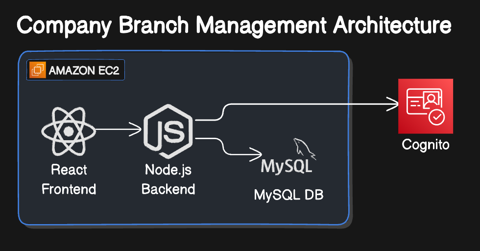
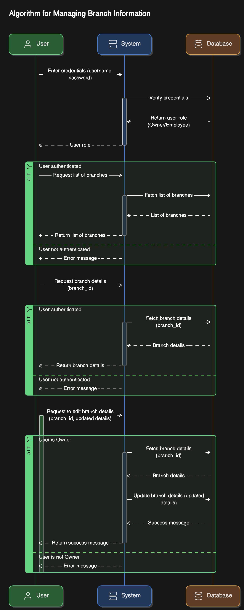

# Branch Management System

## Summary

This project is a Branch Management System that allows company owners to list, view, and edit branch information, while employees can only list and view branch information. The backend is built using Node.js, integrated with Amazon Cognito for authentication, and the frontend is built using React.js. The system follows SOLID principles to ensure a clean and maintainable codebase.


### How can try this project?

Project is currently live on http://mindhub.erengun.dev and you can try it with the following credentials:

- Owner:
  - Email: bob@example.com
  - Password: Bobiscool.123

- Employee:
    - Email: eren@example.com
    - Password: Eroiscool.123

Note: Due to time limitation, SSL certificate is not installed on the server so you have to connect using http protocol instead of https.

## Architecture



## Use-Case Diagram



## Database Diagram


## Technologies

### Backend (Node.js)

The backend is built using Node.js and follows a modular structure with separate directories for configuration, controllers, models, routes, middleware, and utilities. It integrates with Amazon Cognito for user authentication.

### Frontend (React.js)

The frontend is built using React.js and Redux for state management. It provides a user interface for listing, viewing, and editing branches.

### Amazon EC2 Setup

The backend and frontend are deployed on Amazon EC2 instances. Docker is used to containerize the applications for easy deployment and management.

### Amazon Cognito

Amazon Cognito is used for user authentication. It provides a secure and scalable user directory that integrates with the backend API.


## Getting Started

### Prerequisites

- Node.js and npm installed
- Docker installed
- AWS account with EC2 and Cognito setup

### Running the Application

1. **Backend:**

    - Start the backend server:

        ```bash
        cd backend
        npm start
        ```

    - Open your browser and navigate to `http://localhost:3000`

2. **Frontend:**

    - Start the frontend development server:

        ```bash
        cd frontend
        npm start
        ```

    - Open your browser and navigate to `http://localhost:5173`
